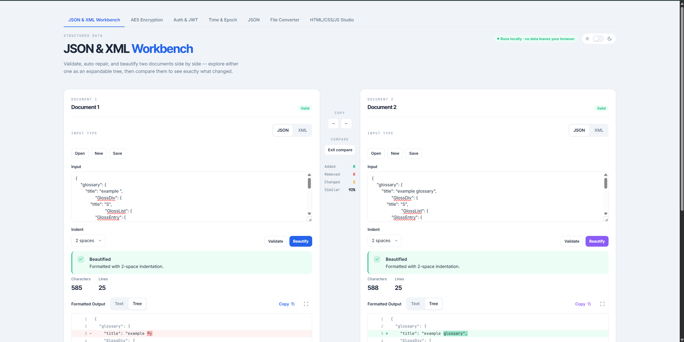
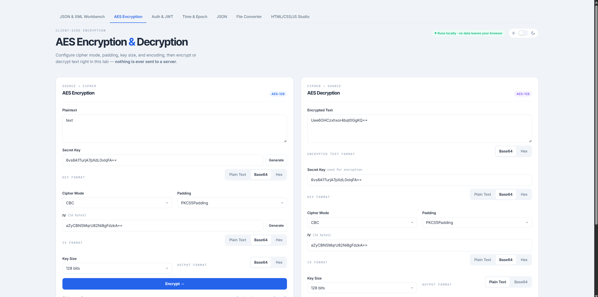
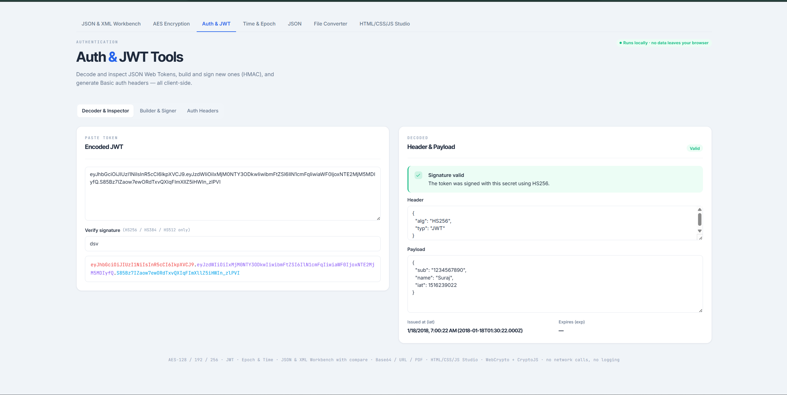
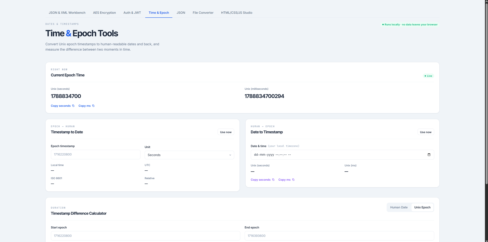
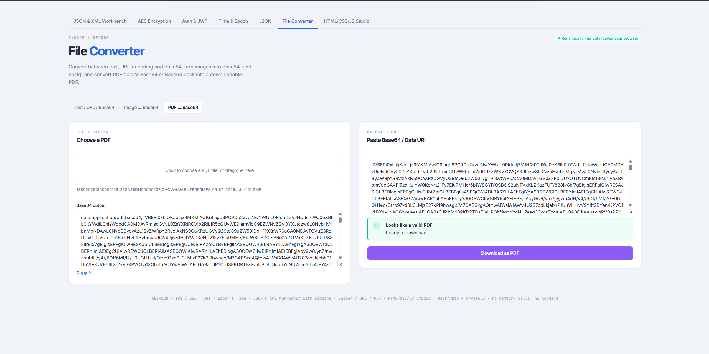
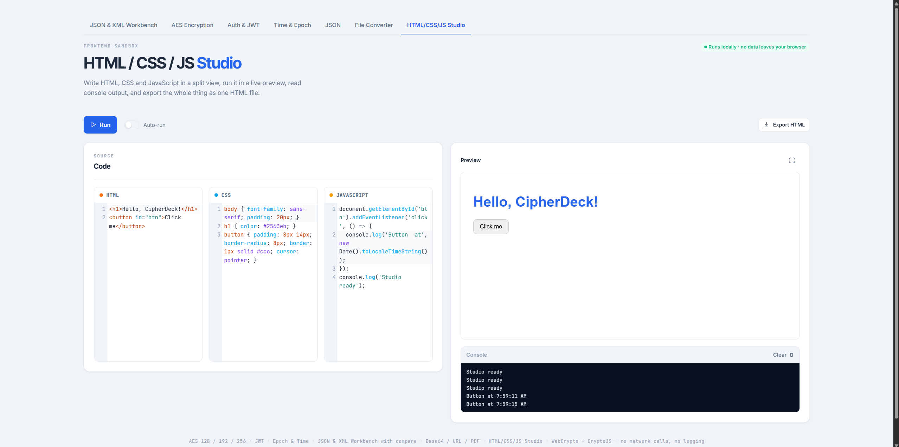

# Developer Toolbox

Useful developer tools that run **locally** inside VS Code.

## Features

- **JSON & XML Formatter** (inside Workbench + current document)
- AES Encryption / Decryption (AES-128/192/256 – ECB/CBC/CTR/CFB/OFB/GCM)
- JWT Decode + Basic Auth
- Time & Epoch Converter
- Base64 / URL / Image / PDF Converter
- HTML / CSS / JS Playground
- Light / Dark Theme

## How to Use

### 1. Open the Workbench (WebView)

1. Open Command Palette (`Ctrl + Shift + P` / `Cmd + Shift + P`)
2. Search **Workbench: AES JSON**
3. The toolbox opens in a new tab

### 2. Beautify Current Document (JSON or XML)

You can also beautify the **currently open file** directly in the editor:

| Action                          | Shortcut (Windows / Linux) | Shortcut (macOS)     |
|---------------------------------|----------------------------|----------------------|
| Beautify JSON / XML             | `Ctrl + Alt + ;`           | `Cmd + Option + ;`   |

Or run the command:

**Workbench: Beautify JSON / XML (Current Document)**

- Works on both `.json` and `.xml` files
- Replaces the entire document content with the formatted version
- Automatically sets the correct language mode

## Tools Overview

| Tool               | Description                                              |
|--------------------|----------------------------------------------------------|
| JSON & XML         | Validate, beautify, Text / Tree view + side-by-side diff |
| AES                | Encrypt / Decrypt locally (no data leaves your machine)  |
| JWT & Basic Auth   | Decode JWT, verify signatures, generate Basic Auth       |
| Time & Epoch       | Convert timestamps, calculate differences                |
| File Converter     | Base64, URL, Image, PDF                                  |
| HTML/CSS/JS Studio | Live playground with preview & console                   |

## Privacy

Everything runs inside the VS Code WebView or the extension host.  
**No backend or external API is used.** Your data never leaves your machine.

## License

MIT

## Online Version

[https://surajprasadd.github.io/Toolbox/](https://surajprasadd.github.io/Toolbox/)

---

## Screenshots

### JSON & XML Formatter

### AES Encryption / Decryption

### JWT Decode + Basic Auth

### Time & Epoch Converter

### Base64 / URL / Image / PDF Converter

### HTML / CSS / JS Playground
